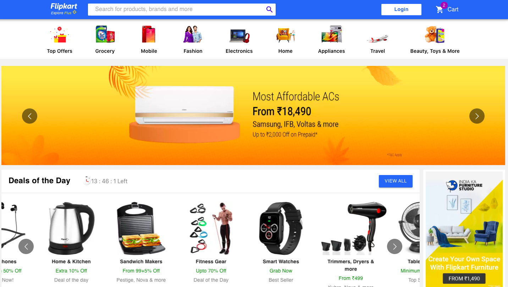
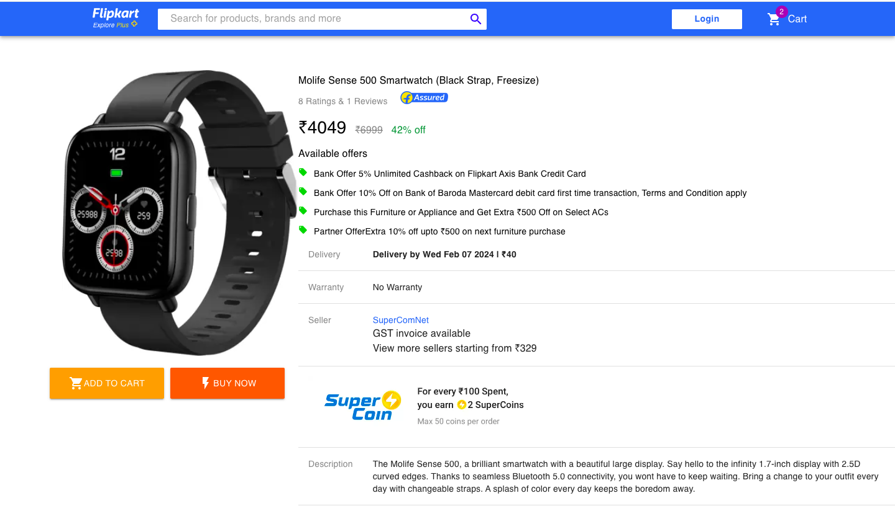
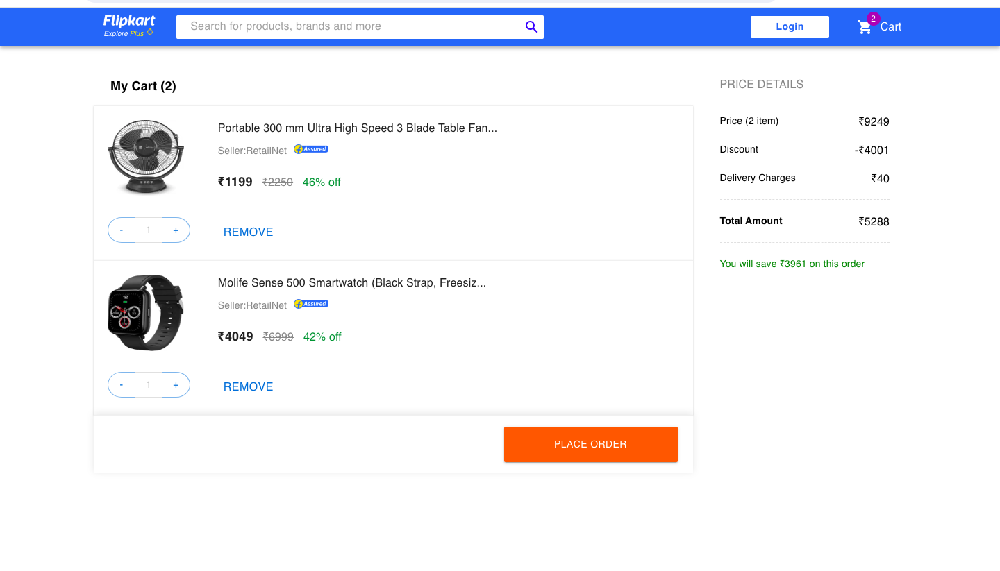

# Flipkart Clone (MERN Stack)
 ## Live : https://flipkart-clone-m.vercel.app/

 




## Description

This repository contains the codebase for a clone of the popular e-commerce platform Flipkart, built using the MERN (MongoDB, Express.js, React.js, Node.js) stack. It encompasses both the frontend and backend components necessary to run the application.

## Features

- **User Authentication**: Allows users to sign up, log in, and manage their accounts securely.
- **Product Catalog**: Displays a wide range of products categorized into various departments for easy navigation.
- **Product Search**: Enables users to search for specific products based on keywords.
- **Product Details**: Provides detailed information about each product, including images, descriptions, prices, and customer reviews.
- **Shopping Cart**: Allows users to add products to their cart, update quantities, and remove items.
- **Checkout Process**: Guides users through a seamless checkout process, including address selection and payment.
- **Payment Integration**: Supports payment via Paytm, allowing users to securely complete transactions.

## Technologies Used

### Frontend
- **Framework**: React.js
- **State Management**: Redux
- **UI Library**: Material-UI

### Backend
- **Framework**: Node.js with Express.js
- **Database**: MongoDB
- **Authentication**: JSON Web Tokens (JWT)
- **Payment Gateway**: Paytm API

## Getting Started

To run this project locally, follow these steps:


 Set up environment variables:

   - Create a `.env` file in the `frontend` directory.
   - Define the required environment variables, such as `API_URL`,


7. Access the application in your browser at `http://localhost:3000`.


## Acknowledgements

- [Flipkart](https://www.flipkart.com/) for inspiring this project.
- [Paytm](https://paytm.com/) for providing the payment gateway.
- [Material-UI](https://material-ui.com/) for the UI components.
```
